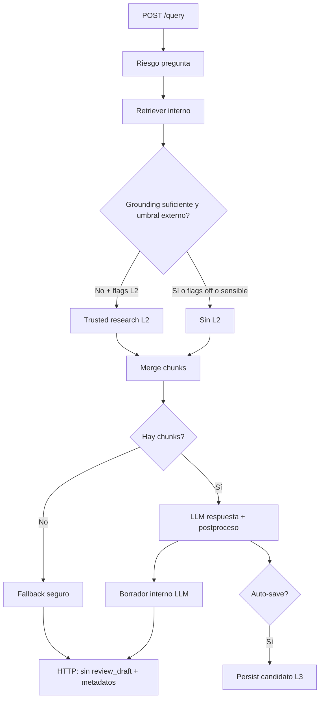

# Trusted external fallback — arquitectura técnica

Documento operativo alineado con el código actual (`src/`). Complementa `docs/PROJECT_DOCUMENTATION.md` sin sustituirlo.

---

## 1. Visión de arquitectura

El flujo de consulta combina **RAG interno** (vectores / documentos curados) con un **fallback opcional** a evidencia de **fuentes externas en lista blanca** (capa “trusted research”), y opcionalmente **persistencia** de candidatos como conocimiento **provisional** (no aprobado).

| Capa | Rol | Módulos principales |
|------|-----|---------------------|
| L1 | Recuperación interna + orquestación de respuesta | `src/core/orchestrator.py`, `src/rag/retriever.py` |
| L2 | Expansión de consulta → recuperación acotada → extracción de evidencia estructurada | `src/research/trusted_research_service.py`, `src/research/web_retriever.py`, `src/research/evidence_extractor.py` |
| L3 | Persistencia de bundles externos como candidatos | `src/research/ingest_candidates.py`, `src/db/models.py` (`ResearchCandidate`, …) |
| API | Contrato HTTP, saneamiento de respuesta | `src/api/routes.py`, `src/api/schemas.py` |
| Política | Promoción de estados, envelope evidencia/síntesis | `src/research/knowledge_promotion_policy.py`, `src/research/evidence_envelope.py` |
| Refresh | TTL / revalidación de bundles provisionales | `src/research/knowledge_refresh.py` |

**Principio:** la respuesta al dueño se basa en contexto recuperado; la evidencia externa **provisional** se etiqueta y puede mezclarse en el prompt solo si los flags lo permiten; la **síntesis LLM** (respuesta + borrador interno) no se trata como evidencia atribuible en persistencia.

---

## 2. Flujo de decisión: `POST /api/v1/query`

Resumen del camino (detalle en `RAGOrchestrator.answer`):

1. **Riesgo de pregunta** (`src/security/guardrails.py` — `assess_query_risk`): términos sensibles / médicos afectan disclaimers, confianza y **bloqueo de L2** si la pregunta es sensible (p. ej. emergencia).
2. **Recuperación interna** con filtros de perfil/filtros de petición.
3. **Grounding interno** (`assess_retrieval_grounding`): hay contexto, suficiencia vs `SIMILARITY_THRESHOLD`, `top_score`.
4. **¿Disparar investigación externa de confianza?** Solo si:
   - `ENABLE_TRUSTED_EXTERNAL_RETRIEVAL` y `ALLOW_PROVISIONAL_IN_QUERY` son verdaderos, **y**
   - la pregunta **no** es sensible, **y**
   - el grounding lo exige (sin contexto, insuficiente, o `top_score` &lt; `EXTERNAL_RESEARCH_TRIGGER_THRESHOLD`).
5. **Fusión de contexto**: chunks internos primero; añadir chunks sintéticos desde evidencia L2 si hubo snippets (`_research_result_to_llm_chunks`).
6. Si **no hay ningún chunk** para el LLM → respuesta **fallback** segura (sin llamada al modelo de respuesta principal).
7. Si hay contexto → **LLM “frontend”** (respuesta al dueño) + **postproceso** (`postprocess_answer`); si hubo evidencia externa en el contexto → disclaimer de contexto provisional.
8. **Segundo LLM** (borrador interno para revisión humana): se genera en orquestador para auditoría; **no** se expone en la respuesta HTTP pública (`review_draft` siempre `null` en `routes.py`).
9. **Auto-guardado** (opcional): si flags de persistencia y L2 en query están activos, se llama a `ingest_external_research_candidate` con envelope v2 (evidencia vs síntesis separadas — `build_separated_evidence_json`).

La respuesta HTTP incluye además **`answer_source`** y **`knowledge_status`** (`QueryResponse` en `src/api/schemas.py`) para clientes nuevos sin romper campos existentes.

---

## 3. Feature flags (entorno)

Definidos en `src/core/config.py` (prefijos típicos en `.env.example`):

| Variable | Efecto |
|----------|--------|
| `ENABLE_TRUSTED_EXTERNAL_RETRIEVAL` | Maestro L2: si `false`, no se construye el servicio real de investigación en el orquestador por defecto. |
| `ALLOW_PROVISIONAL_IN_QUERY` | Si `false`, **nunca** se mezcla evidencia externa provisional en `/query` (RAG solo interno aunque el maestro sea `true`). |
| `EXTERNAL_RESEARCH_TRIGGER_THRESHOLD` | Si hay contexto interno pero el **mejor score** es inferior a este valor, se permite intentar L2. |
| `ENABLE_AUTO_SAVE_PROVISIONAL_KNOWLEDGE` | Tras respuesta exitosa **con** evidencia externa usada en query, persiste un `ResearchCandidate` (requiere también maestro + allow provisional en query). |
| `EXPOSE_REVIEW_DRAFT_IN_QUERY_API` | **Obsoleto**: la ruta `/query` fuerza `review_draft=null`; la variable se mantiene solo por compatibilidad de parseo de entorno. |

Por defecto en código, los flags de L2 / provisional / auto-save suelen estar en **`false`** para comportamiento equivalente a RAG interno únicamente.

---

## 4. Modelo de datos (resumen)

- **`research_candidates`** (`ResearchCandidate`): fila de bundle externo o candidato; `status` ∈ `provisional | approved | needs_review | expired`; `evidence_json` **schema v2** con:
  - **`evidence`**: registros normalizados (URL, dominio, título, snippet, `authority_score`, ids) + `research_evidence` + `retrieval_extraction_bundle` (metadatos de extracción, no narrativa LLM).
  - **`synthesis`**: `frontend_answer` (marcado seguro API) y `review_draft` (texto LLM, `ai_generated` / `provisional` / `not_evidence`).
  - Columna `synthesis_text`: reservada; en persistencias nuevas suele ir **vacía** (texto en JSON).
- **`knowledge_sources`**, **`research_candidate_sources`**: vínculos a fuentes y snippets (ver `persist_external_research_with_session` en `ingest_candidates.py`).
- **Respuesta API** (`QueryResponse`): campos históricos intactos + `answer_source`, `knowledge_status`; fuentes en `sources` reflejan el contexto mostrado al usuario (incl. ítems provisionales cuando aplica).

---

## 5. Reglas de seguridad (comportamiento actual)

- **Preguntas sensibles** (palabras clave en `SENSITIVE_KEYWORDS`): no se invoca L2; prioridad a mensajes de seguridad / baja confianza según guardrails.
- **Contexto provisional** en prompt: instrucciones al LLM para **preferir pasajes internos** y no presentar extractos externos como verdad clínica definitiva (`_build_frontend_system_prompt`).
- **Disclaimer** adicional cuando se usó evidencia externa provisional (`EXTERNAL_PROVISIONAL_CONTEXT_DISCLAIMER` en `guardrails.py`).
- **API pública**: no se expone el borrador interno de revisión LLM; `review_draft` en JSON de respuesta es siempre `null`.
- **Allowlist**: URLs fuera de dominios registrados se **bloquean** en recuperación estructurada (`BlockedUrl` en `web_retriever.py`); sin hits válidos no hay augmentación.

---

## 6. Política: provisional vs aprobado

Centralizada en `src/research/knowledge_promotion_policy.py`:

- **Nunca** se crea conocimiento **aprobado** automáticamente desde síntesis LLM sola.
- Ingesta inicial de fallback externo: **`provisional`** por defecto; temas médicos / heurísticas sensibles → **`needs_review`**.
- Transiciones explícitas documentadas en el módulo (p. ej. `provisional` → `approved` solo con `promotion_source=manual_curator`).
- **Refresh** (`decide_refresh_evidence` en `knowledge_refresh.py`) **no** emite `approved`; filas con candado médico / `needs_review` previo permanecen en esa vía salvo expiración u otras reglas.

---

## 7. Refresh y TTL

- **`review_after`**: sugerencia de revalidación en `ResearchResult` / fila candidata (`default_review_after` en `knowledge_refresh.py`).
- **`run_refresh_batch`**: procesa candidatos vencidos por `review_after`, re-ejecuta investigación de confianza y aplica `decide_refresh_evidence` (provisional / needs_review / expired según evidencia nueva vs antigua, colapso de autoridad, solapamiento de snippets, etc.).
- **Compatibilidad de envelope**: `extract_snippet_texts_from_envelope` admite `schema_version` 2 (`evidence.records` o `research_evidence.snippets`) y legado v1.

---

## 8. Modos de fallo (operativos)

| Situación | Comportamiento típico |
|-----------|-------------------------|
| Sin chunks internos ni externos | Respuesta **fallback**; `answer_source=fallback`, `knowledge_status=none`. |
| L2 invocado pero 0 snippets (todo bloqueado o vacío) | Sin augmentación; mismo patrón que sin contexto si no queda ningún chunk. |
| Error al persistir candidato | Log de excepción; la respuesta al usuario **no** falla por ello. |
| LLM / red del proveedor externo real | En entornos con retriever real, timeouts y cuotas deben manejarse en capa de proveedor (futuro); hoy los tests usan mocks. |
| Flags inconsistentes | Si el maestro está on pero `ALLOW_PROVISIONAL_IN_QUERY` off, el orquestador usa servicio deshabilitado y no mezcla provisional. |

---

## 9. Consideraciones para producción (futuro)

- **Registry de fuentes**: `StaticTrustedSourceRegistry` vs registro dinámico por entorno; revisión legal de dominios y `authority_score`.
- **Cuotas y coste**: L2 + segundo LLM de revisión aumentan tokens y latencia; circuit breakers y degradación a solo-RAG.
- **Observabilidad**: métricas por `answer_source`, ratio de `blocked` en L2, tasa de `needs_review` vs `provisional`.
- **Jobs**: programar `run_refresh_batch` (cron / worker) con límites y backoff.
- **Promoción humana**: UI o API interna (no pública) que llame a las funciones de `knowledge_promotion_policy` tras autenticación de curador.
- **OpenAPI**: mantener `docs/api/openapi.yaml` sincronizado con `QueryResponse` cuando se regenere el contrato.

---

## Referencias rápidas en código

| Tema | Ubicación |
|------|-----------|
| Disparo L2 y merge | `src/core/orchestrator.py` |
| Flags | `src/core/config.py`, `.env.example` |
| Persistencia envelope | `src/research/ingest_candidates.py`, `src/research/evidence_envelope.py` |
| Política de estados | `src/research/knowledge_promotion_policy.py` |
| Refresh | `src/research/knowledge_refresh.py` |
| Contrato HTTP | `src/api/schemas.py`, `src/api/routes.py` |
| Pruebas e2e con mocks | `tests/integration/test_trusted_external_fallback_e2e.py` |
